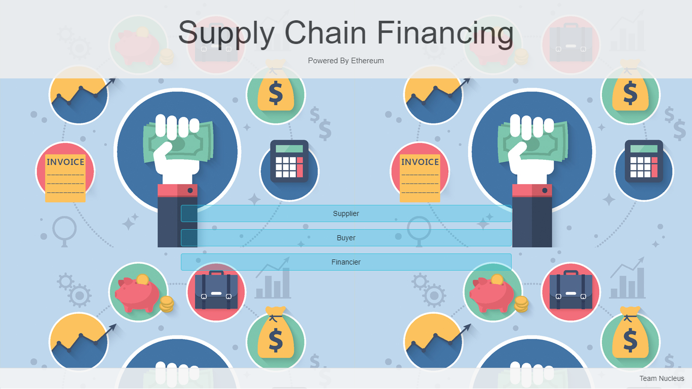
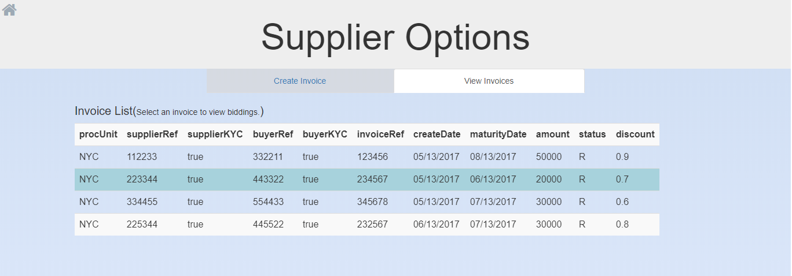
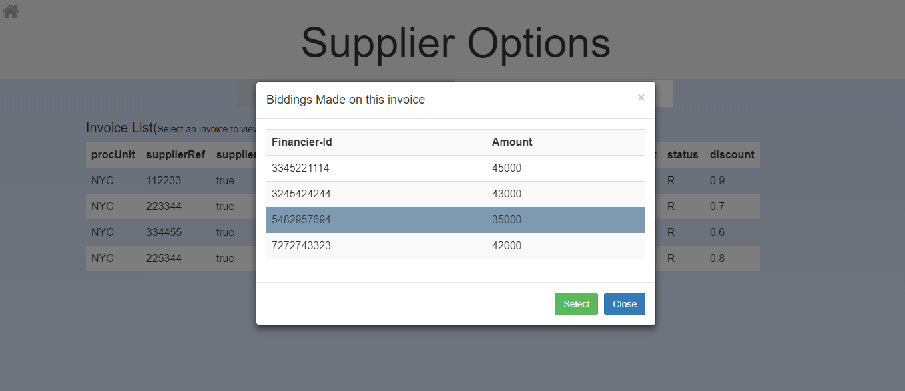
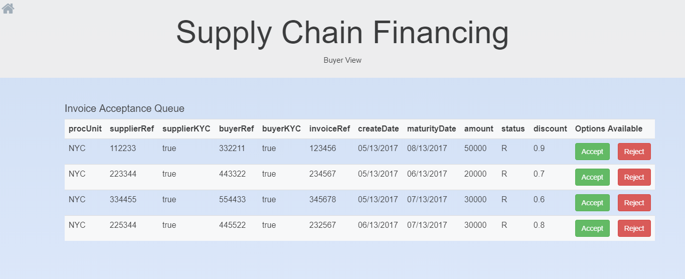
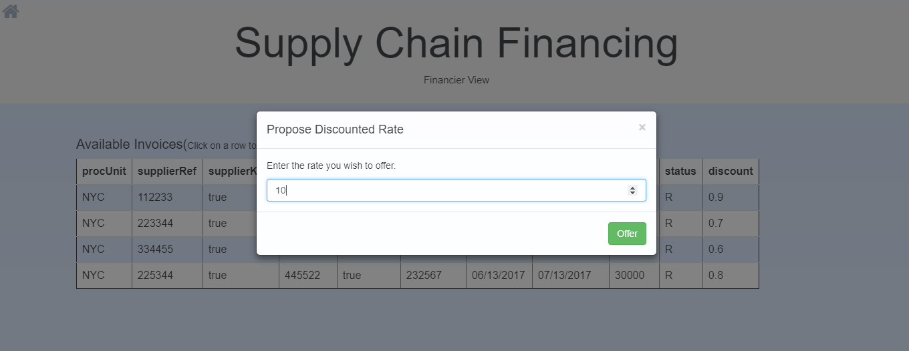
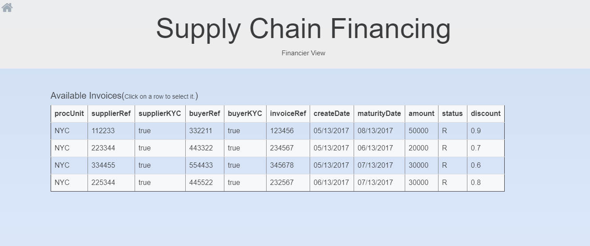

# Supply Chain Financing powered by Ethereum

Our [project](https://adityarar.github.io/Supply-Chain-Financing-Powered-By-Ethereum/) submission for the final round of the national level [hackathon](https://www.eventbrite.com/e/blockchain-india-week-hackathon-by-blockchain-storm-13-14-may17-ft-vitalik-buterin-tickets-32452083054) conducted by [Blockchain Storm](https://www.eventbrite.com/o/blockchain-storm-6118982129).

**Project screenshots :**
<br>


<br><br><br>

<br><br><br>

<br><br><br>

<br><br><br>

<br><br><br>


# truffle-init-webpack
Example webpack project with Truffle. Includes contracts, migrations, tests, user interface and webpack build pipeline.

## Usage

To initialize a project with this exapmple, run `truffle init webpack` inside an empty directory.

## Building and the frontend

1. First run `truffle compile`, then run `truffle migrate` to deploy the contracts onto your network of choice (default "development").
1. Then run `npm run dev` to build the app and serve it on http://localhost:8080

## Possible upgrades

* Use the webpack hotloader to sense when contracts or javascript have been recompiled and rebuild the application. Contributions welcome!

## Common Errors

* **Error: Can't resolve '../build/contracts/MetaCoin.json'**

This means you haven't compiled or migrated your contracts yet. Run `truffle compile` and `truffle migrate` first.

Full error:

```
ERROR in ./app/main.js
Module not found: Error: Can't resolve '../build/contracts/MetaCoin.json' in '/Users/tim/Documents/workspace/Consensys/test3/app'
 @ ./app/main.js 11:16-59
```
